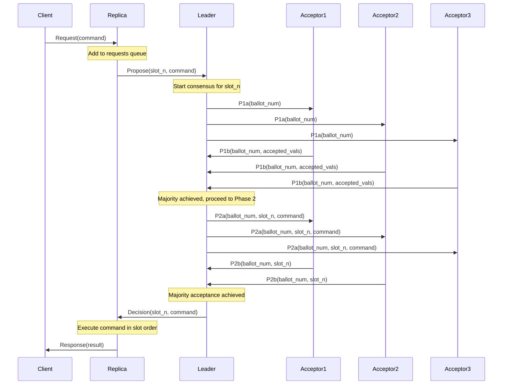
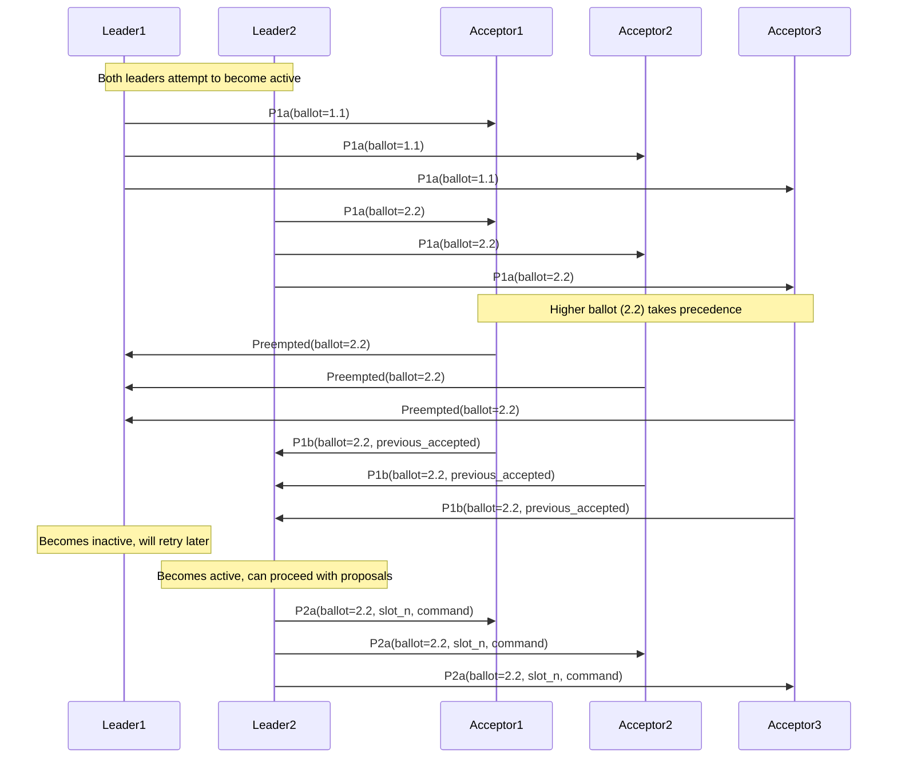
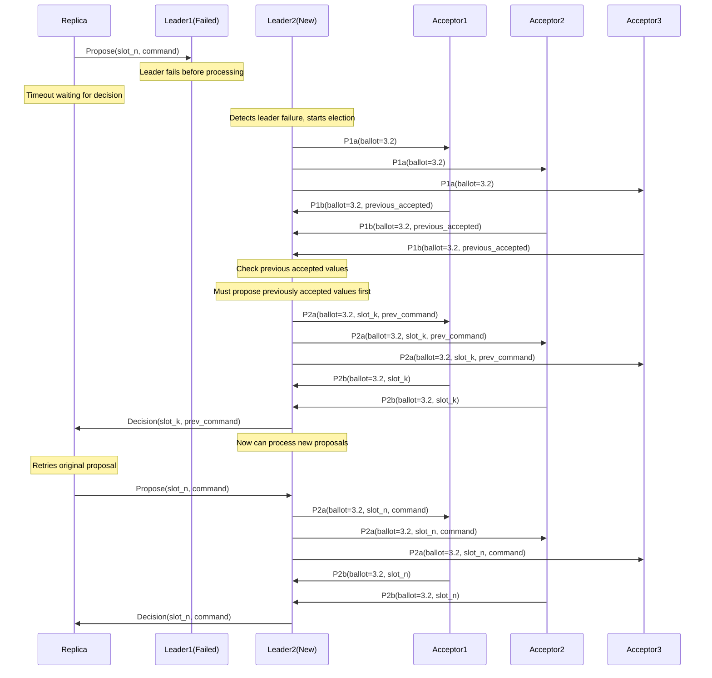
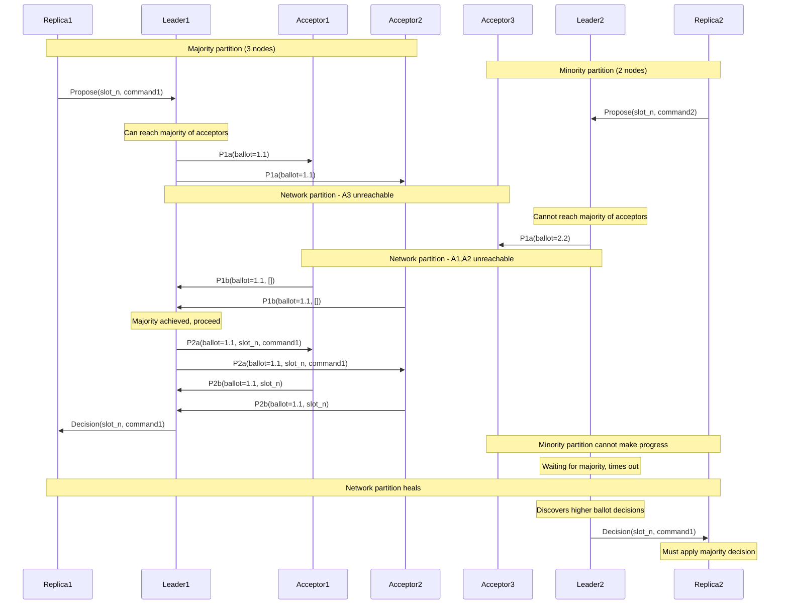
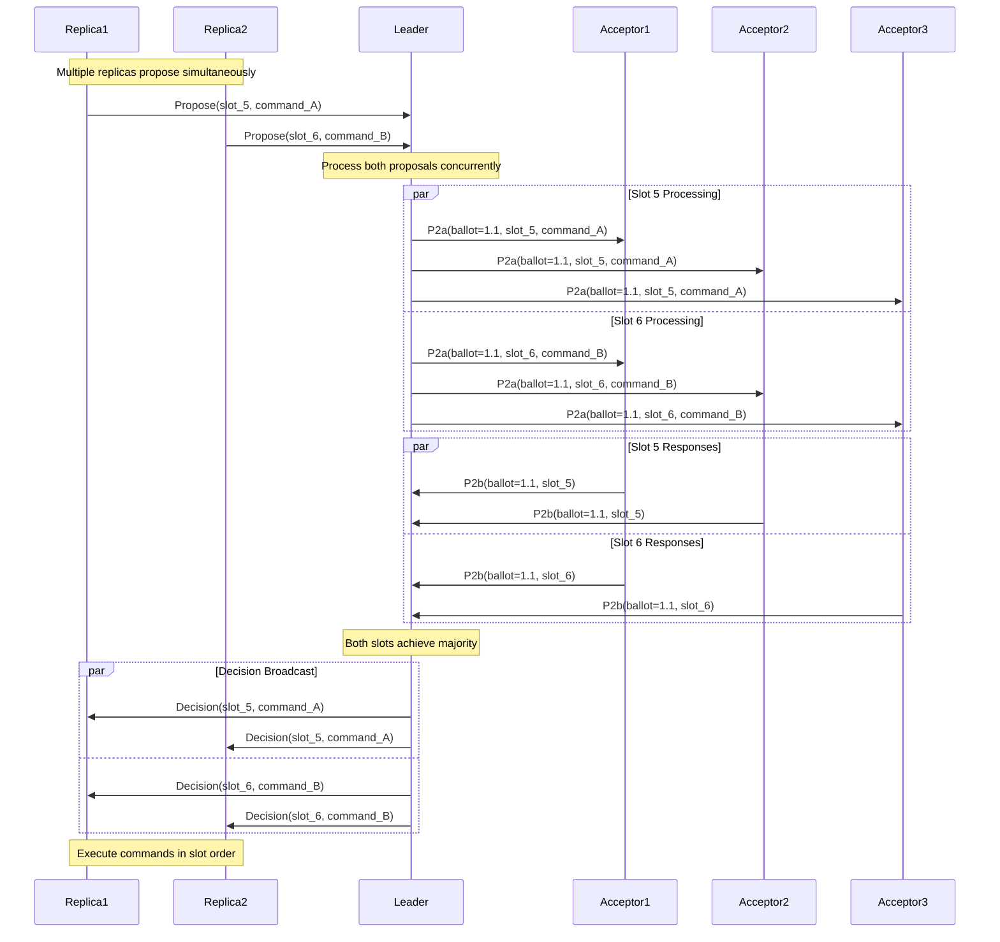

# Sequence Diagrams

This section illustrates the message flows and timing relationships between nodes during various operational scenarios. These diagrams help visualize the distributed coordination required for consensus.

## Normal Operation Sequence

The following diagram shows the complete flow from client request to response during normal system operation.

### Key Points

- Client request triggers the entire consensus process
- Two-phase protocol ensures safety with majority agreement
- Decision broadcast enables all replicas to execute the command
- Response sent after command execution maintains consistency

## Leader Election Sequence

This diagram shows how leadership conflicts are resolved when multiple leaders compete.

### Key Points

- Multiple leaders can attempt activation simultaneously
- Higher ballot numbers take precedence (lexicographic ordering)
- Preempted leaders become inactive and must retry with higher ballots
- Only one leader becomes active per ballot round

## Failure Recovery Sequence

This diagram illustrates how the system handles leader failure and recovery.

### Key Points

- Failure detection occurs through timeouts
- New leader must first complete any partially accepted proposals
- Previously accepted values take priority over new proposals
- System maintains consistency despite leader changes

## Network Partition Scenario

This diagram shows behavior during a network partition where nodes are split into groups.

### Key Points

- Only partitions with acceptor majority can make progress
- Minority partitions cannot achieve consensus and wait
- When partition heals, minority adopts majority decisions
- Consistency is maintained across partition boundaries

## Concurrent Proposals Sequence

This diagram shows how multiple concurrent proposals are handled across different slots.

### Key Points

- Multiple slots can be processed concurrently
- Each slot requires independent majority agreement
- Commands are executed in slot order regardless of decision timing
- Parallelization improves system throughput
