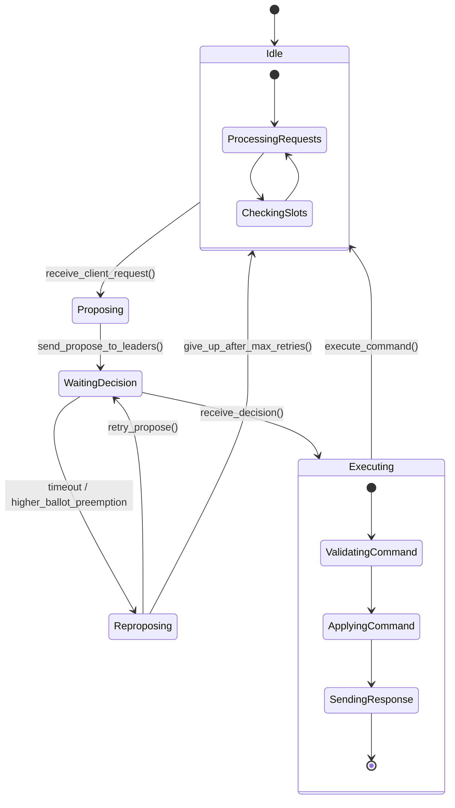
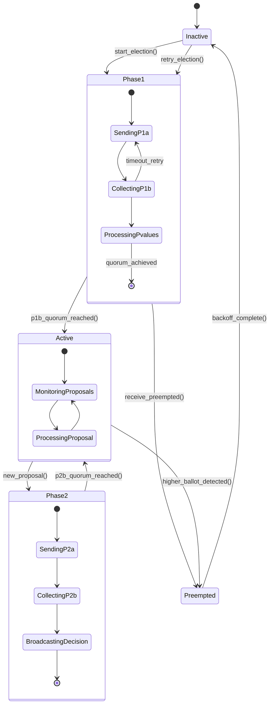
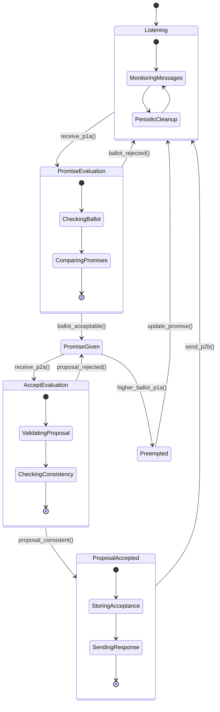

# State Diagrams

This section presents the state machines for each node type in the MultiPaxos implementation. Understanding these state transitions is crucial for comprehending node behavior and system dynamics.

## Replica State Machine

Replicas manage client requests and coordinate with leaders to maintain consistent state across the distributed system.

### State Descriptions

**Idle**: Replica is ready to accept new client requests and process incoming decisions.

**Proposing**: Replica is preparing to send command proposals to leaders for available slots.

**WaitingDecision**: Replica has sent proposals and is waiting for consensus decisions from leaders.

**Executing**: Replica is applying decided commands to its state machine and preparing client responses.

**Reproposing**: Replica is retrying failed proposals, typically due to leader preemption or timeout.

### Key Transitions

- **Client Request**: Triggers transition from Idle to Proposing
- **Proposal Sent**: Moves from Proposing to WaitingDecision
- **Decision Received**: Advances from WaitingDecision to Executing
- **Timeout/Preemption**: Causes transition to Reproposing state
- **Command Applied**: Returns to Idle state for next request cycle

## Leader State Machine

Leaders coordinate the consensus process through ballot management and two-phase protocol execution.

### State Descriptions

**Inactive**: Leader is not currently participating in consensus, waiting for election opportunity.

**Phase1**: Leader is gathering P1b promises from acceptors and processing accepted pvalues to resolve conflicts.

**Phase2**: Leader is sending P2a proposals for specific slots and collecting P2b acceptances.

**Active**: Leader has successfully completed Phase 1, is active, and ready to process new proposals from replicas.

**Preempted**: Leader has been superseded by a higher ballot and must become inactive.

### Key Transitions

- **Start Election**: Inactive leader begins Phase 1 with new ballot
- **P1b Quorum Reached**: Phase 1 succeeds, leader processes pvalues and becomes active
- **Preempted**: Higher ballot detected, leader becomes inactive
- **New Proposal**: Active leader starts Phase 2 for new slot
- **P2b Quorum Reached**: Phase 2 succeeds, leader broadcasts decision
- **Backoff Complete**: Preempted leader waits before retry

## Acceptor State Machine

Acceptors maintain the persistent storage for consensus decisions and enforce protocol safety properties.

### State Descriptions

**Listening**: Acceptor is ready to receive and process protocol messages from leaders.

**PromiseEvaluation**: Acceptor is evaluating a P1a message to determine if it should make a promise.

**PromiseGiven**: Acceptor has promised not to accept lower ballots and awaits P2a messages.

**AcceptEvaluation**: Acceptor is evaluating a P2a message for consistency with previous promises.

**ProposalAccepted**: Acceptor has accepted a proposal and is updating persistent state.

**Preempted**: Acceptor has received a higher ballot and must update its promises.

### Key Transitions

- **P1a Received**: Triggers evaluation of prepare request
- **Promise Made**: Acceptor commits to ignoring lower ballots
- **P2a Received**: Triggers evaluation of accept request
- **Proposal Accepted**: Acceptor stores the accepted value
- **Higher Ballot**: Causes preemption and promise update

## Cross-Node Interaction Patterns

The state machines interact through message exchanges that drive state transitions across the distributed system:

**Client-Replica Interaction**: Client requests trigger replica state changes from Idle to Proposing.

**Replica-Leader Coordination**: Replica proposals cause active leaders to enter Phase 2 for specific slots.

**Leader-Acceptor Protocol**: Leader Phase 1 and Phase 2 operations drive acceptor state transitions through promise and accept evaluations.

**Failure Detection**: Timeouts in any node can trigger state transitions that initiate recovery procedures.

These state machines operate concurrently across multiple nodes, with message passing providing the coordination mechanism that ensures consistent behavior throughout the distributed system.
